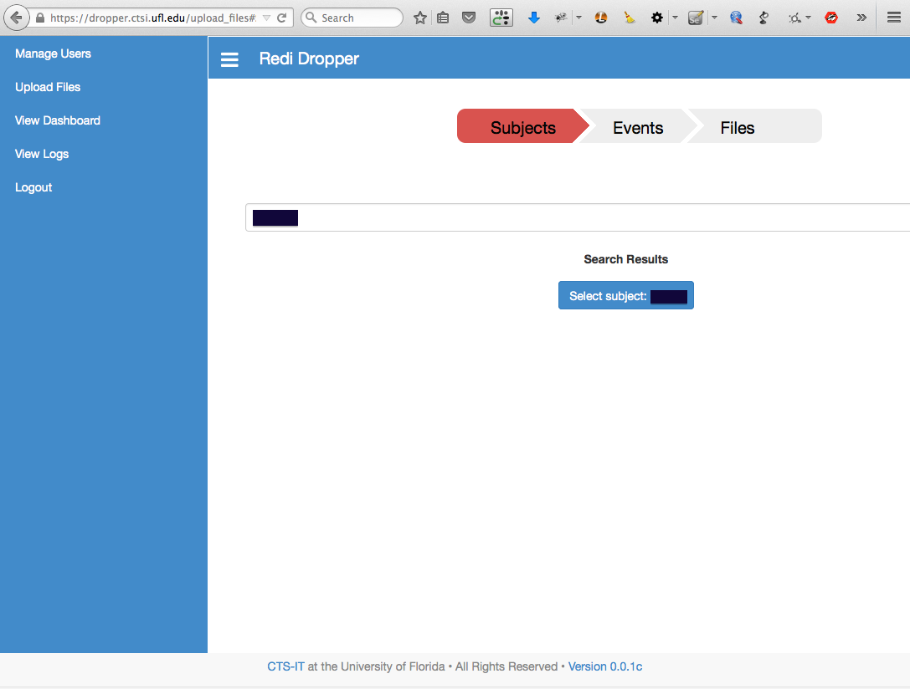

# RediDropper

Master branch: 

Develop branch: 

## Introduction

This repository contains a web application written in python using the
[Flask framework](http://flask.pocoo.org)

The main goal of the web application is to implement a tool for uploading MRI
images to a central location in order to facilitate collaboration between
research teams at University of Florida and other universities.

## For Developers

For more details on application development please navigate to the
[Application README](app/README.md).

For running the unit tests please navigate to the
[Testing README](app/tests/README.md).

## Application Screenshots

For more screenshots please navigate to the [images folder](docs/img).

## License

This software is distributed under the BSD 3-Clause License.
For more information please read the [LICENSE](LICENSE) file.

## Read the docs

For an easier navigation through the documentation please navigate to
[Read the docs](http://redi-dropper-client.readthedocs.org/en/latest/).
