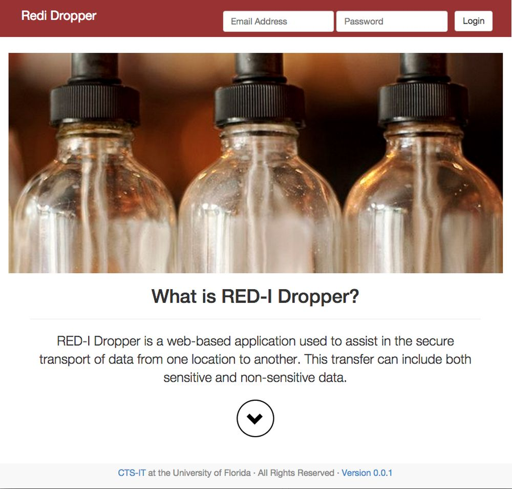
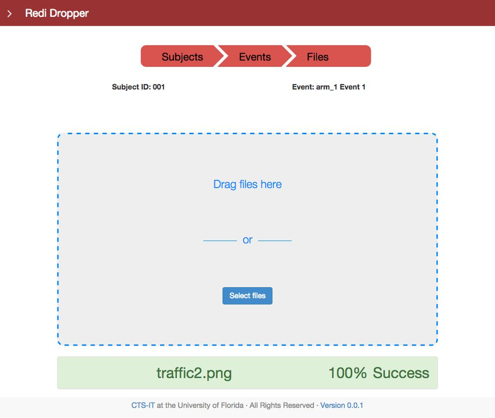

# RediDropper

| Branch | [Travis-CI](https://travis-ci.org/ctsit/redi-dropper-client/builds) | [Coveralls](https://coveralls.io/github/ctsit/redi-dropper-client) |
| :----- | :---------------------------: | :-------: |
| [Master](https://github.com/ctsit/redi-dropper-client/tree/master) |  |  |
| [Develop](https://github.com/ctsit/redi-dropper-client/tree/develop) |  |  |

## Introduction

This repository contains a web application written in python using the
[Flask framework](http://flask.pocoo.org)

The main goal of the web application is to implement a tool for uploading MRI
images to a central location in order to facilitate collaboration between
research teams at University of Florida and other universities.

## For Developers

For more details on application development please navigate to the
[Application README](app/README.md).

For running the unit tests please navigate to the
[Testing README](app/tests/README.md).

## Application Screenshots

For more screenshots please navigate to the [images folder](docs/img).

## License

This software is distributed under the BSD 3-Clause License.
For more information please read the [LICENSE](LICENSE) file.

## Documentation

For an easier navigation through the documentation please navigate to
[Read the docs](http://redi-dropper-client.readthedocs.org/en/latest/).

# Contributing

We encourage input and collaboration from the community.
Please fork the code, implement changes, and submit a
[pull request](https://github.com/ctsit/redi-dropper-client/pulls).

If you prefer to report a bug or make a suggestion, please create a GitHub
[issue](https://github.com/ctsit/redi-dropper-client/issues); issues are a great
place to ask public questions too. Please note that this project is released with
a [Contributor Code of Conduct](http://contributor-covenant.org/version/1/0/0/).
By participating in this project you agree to abide by its terms.

# Contributors

The application was written by Andrei Sura with tremendous support, fedback
and contributions from the entire
[CTS-IT team](https://www.ctsi.ufl.edu/research/study-development/informatics-consulting/).

For the complete list of contributors please see [AUTHORS.md](AUTHORS.md)
