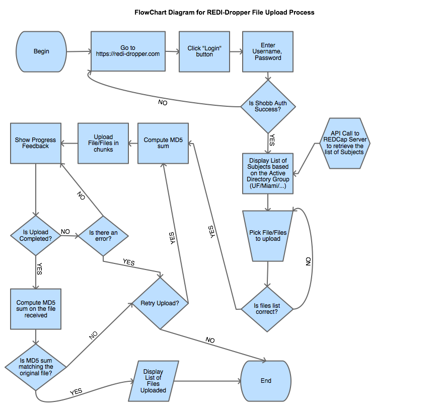

# Work in progress

Technical Specifications for REDIDropper
========================================

## Software Architecture Considerations

1. **use two repositories**

   One repository is used for the **client** component and the second one for the **server** component

   Advantages:
      1. develop the UI separately from the server (different language/framework)
      2. force developers to think about the "Not Breaking the Contract" as defined by the supported API functions
      3. keep the list of issues related to the UI separate from the Server issues

   Disadvantages:
      1. can encounter issues with cross-domain requests if the client is deployed on a different server
      2. forces deployment of two repositories in order to test the application
      3. forces the need to check two repositories during development in order to keep track of changes

2. **use frameworks to allow reusing existing solutions**

   Client Candidates:
      1. [Angular](https://angularjs.org/)
      2. [ReactJS](https://github.com/reactjs/react-tutorial) with [Flux](https://github.com/facebook/flux) [comprehensive-guide](http://tylermcginnis.com/reactjs-tutorial-a-comprehensive-guide-to-building-apps-with-react/)
      3. [Knockout](http://knockoutjs.com/)
      4. [BackboneJS](http://backbonejs.org/) [blog-posts](https://github.com/jashkenas/backbone/wiki/Tutorials%2C-blog-posts-and-example-sites)

   Server Candidates:
      1. Python: [Werkzeug](http://werkzeug.pocoo.org/docs/0.9/routing/#), [Flask](http://flask.pocoo.org/docs/0.10/tutorial/), web2py, Tornado, Bottle, CherryPy, Django, Grok, Pylons, Pyjamas, Pyramid
      2. NodeJS: [Express](http://expressjs.com/starter/basic-routing.html), EmberJS, SailsJS
      3. PHP: CakePHP, Slim, Laravel, Joomla, Symfony
      4. Ruby: Sinatra

3. **implement data transfer between the server component and REDCap**

   Candidates:
      1. [CURL](https://github.com/sburns/advanced-redcap-interfaces/blob/master/slides.md)
      2. [Pycap](http://pycap.readthedocs.org/en/latest/)

4. **use a JS library for implementing the large file upload within the browser**

   Candidates:
      1. [ng-flow](https://github.com/flowjs/ng-flow) ( [PHP server component](https://github.com/flowjs/flow.js/blob/master/samples/Backend%20on%20PHP.md) )
      2. [resumable.js](https://github.com/23/resumable.js/blob/master/samples/Backend%20on%20PHP.md)
      3. [Real ajax uploader](http://www.albanx.com/programing/ajaxupload/?example=2)

   @TODO: read http://stackoverflow.com/questions/2502596/python-http-post-a-large-file-with-streaming

5. understand shibboleth authorization scheme

6. **choose a server for deployment**

   Candidates:
      1. [Apache](http://flask.pocoo.org/docs/0.10/deploying/mod_wsgi/)
      2. [Nginx](https://www.digitalocean.com/community/tutorials/how-to-deploy-python-wsgi-applications-using-uwsgi-web-server-with-nginx) 

         [Servers Comparison](https://www.digitalocean.com/community/tutorials/a-comparison-of-web-servers-for-python-based-web-applications)

## Flow Charts

## Creating large test files

<pre>
   fallocate -l 1G large_file.mri
   dd if=/dev/zero of=large_file.mri bs=1G count=1
</pre>
